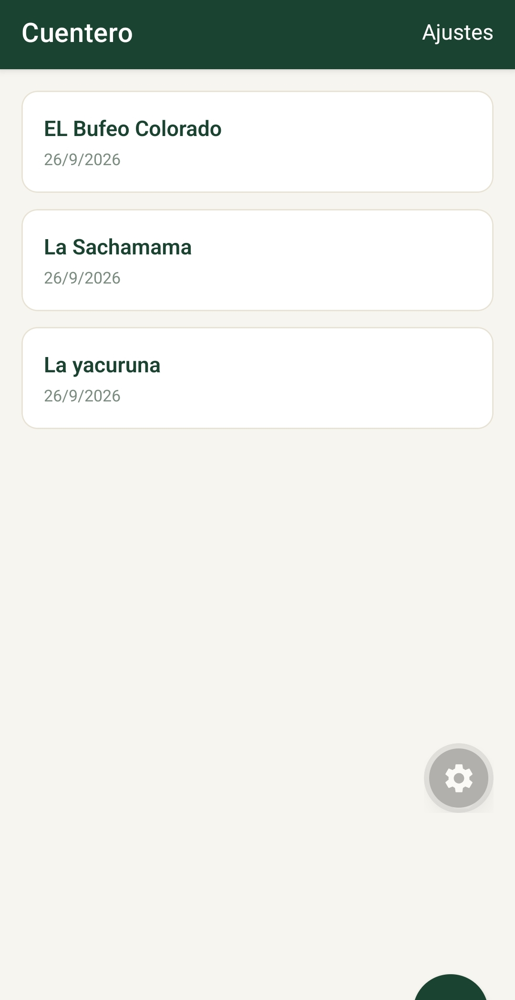
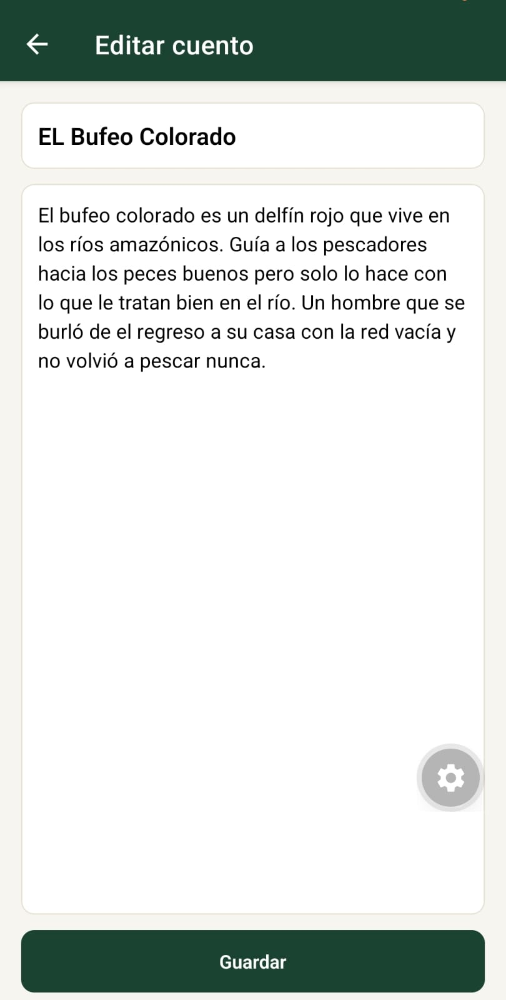
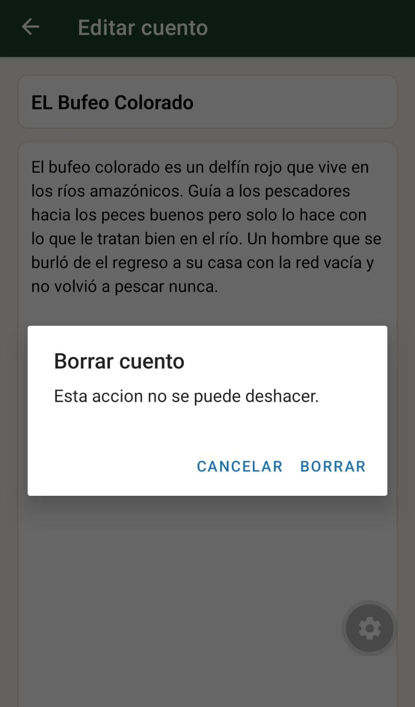
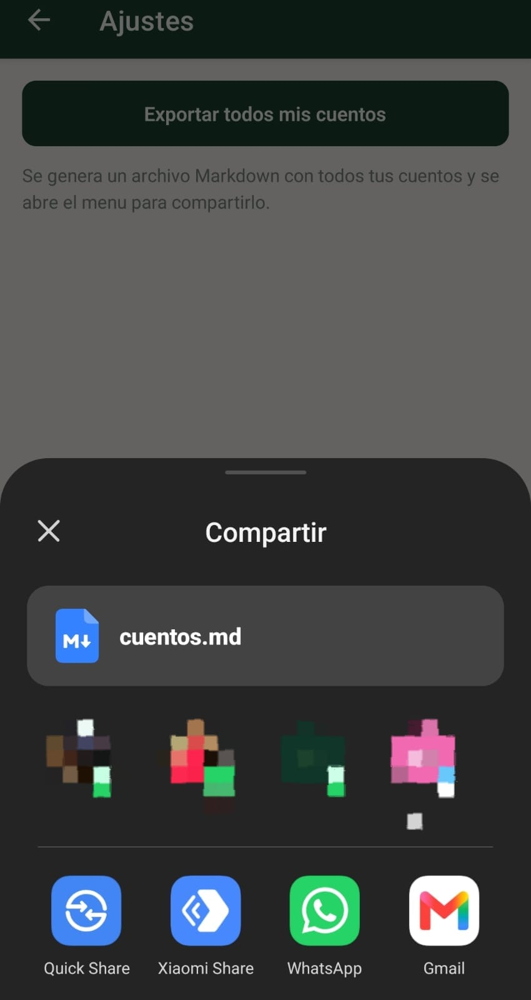

# Cuentero

**Estudiante:** Neptali Rajit Vargas Arévalo

## Tareas resueltas

**Nivel 1 (obligatorias) — las 5 completadas:**

- **T1. Contador de cuentos.** La cabecera de la lista muestra cuántos cuentos hay guardados.
- **T2. Contador de palabras.** El editor muestra cuántas palabras lleva escritas, en vivo.
- **T3. Vista previa en la tarjeta.** Cada tarjeta muestra las primeras líneas del cuento.
- **T4. Confirmar salida sin guardar.** Si editas y presionas atrás, pregunta si descartas los cambios.
- **T5. Tres cuentos propios de la selva.** Escritos y guardados en la app, y exportados con
  el botón *Ajustes → Exportar todos mis cuentos*. El archivo resultante es
  [`cuentos.md`](cuentos.md), incluido en este repositorio.

**Nivel 2:** no implementado (requiere investigación en la documentación de Expo).

## Pasos para ejecutar el proyecto

1. Instalar las dependencias:

   ```bash
   npm install
   ```

2. Instalar la app **Expo Go** en el celular (Play Store o App Store).
   El celular y la computadora deben estar en la misma red Wi-Fi.

3. Iniciar el servidor de desarrollo:

   ```bash
   npx expo start
   ```

4. Escanear el código QR que aparece en la terminal desde la app Expo Go.
   La aplicación se abre en el celular.

## Capturas de pantalla

**Lista de cuentos**



**Editor de cuento**



**Confirmación al borrar un cuento**



**Archivo cuentos.md exportado y compartido**


